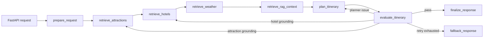

# Intelligent Trip Planner

A stateful AI trip-planning application that combines live travel services, destination-focused retrieval, structured generation, and an evaluation-driven recovery loop.

The backend uses **FastAPI**, **LangChain**, and **LangGraph** to coordinate attraction retrieval, hotel retrieval, deterministic weather lookup, Chroma RAG, itinerary generation, validation, retry routing, fallback handling, memory, and local observability.

## Why This Project

Generating an itinerary is not a single prompt problem. A useful plan must align dates, preserve the user's transportation and accommodation choices, use real POIs, incorporate destination-specific guidance, remain internally consistent, and recover when model output is malformed or unsupported.

This project treats trip planning as a typed workflow with explicit reliability controls instead of an opaque LLM call.

## Architecture



Core layers:

- **LangGraph orchestration:** typed state, in-memory checkpointing, conditional retries, fallback control flow.
- **LangChain runtime:** `ChatOpenAI`, structured output parsing, and native AMap tool wrappers.
- **RAG:** Chroma with OpenAI `text-embedding-3-small` embeddings over approved destination knowledge.
- **Deterministic services:** authoritative weather data and direct AMap POI retrieval.
- **Evaluation and observability:** hard validation, soft quality diagnostics, evidence attribution, node latency, retry traces, and SQLite-backed run inspection.
- **Human-in-the-loop ingestion:** source manifest, rule-based extraction, draft review, approved promotion, and index rebuild.

See [Architecture](docs/architecture.md), [RAG and HITL](docs/rag-and-hitl.md), and [Evaluation and Benchmarks](docs/evaluation-and-benchmarks.md).

## Verified Internal Benchmark Signals

On a fixed 12-request benchmark across Beijing, Shanghai, Hangzhou, and Guangzhou:

| Metric | Chroma RAG result |
| --- | ---: |
| Retrieval recall@4 | 91.67% |
| Retrieval hit rate | 100% |
| Hard validation pass rate | 100% |
| Evidence attribution coverage | 100% |
| Recovery rate for initially failed runs | 100% |
| Fallback rate | 0% |

These are internal benchmark results, not production traffic metrics. The dataset and a sanitized summary are included for reproducibility.

## Quick Start

Prerequisites:

- Python 3.11+
- Node.js 20+
- AMap Web Service API key
- OpenAI or OpenAI-compatible LLM API key

Start the backend:

```bash
cd backend
python -m venv venv
source venv/bin/activate
pip install -r requirements.txt
cp .env.example .env
uvicorn app.api.main:app --reload --host 0.0.0.0 --port 8000
```

Start the web client:

```bash
cd frontend
npm install
cp .env.example .env
npm run dev
```

Open `http://localhost:5173`. API documentation is available at `http://localhost:8000/docs`.

## Example Request

```bash
curl -X POST http://localhost:8000/api/trip/plan \
  -H "Content-Type: application/json" \
  -d '{
    "city": "北京",
    "start_date": "2026-07-01",
    "end_date": "2026-07-02",
    "travel_days": 2,
    "transportation": "公共交通",
    "accommodation": "经济型酒店",
    "preferences": ["历史文化", "美食"],
    "free_text_input": "希望行程不要太赶"
  }'
```

## Tests And Benchmarks

```bash
cd backend
venv/bin/python -m unittest discover -s tests -p "test_*.py"

venv/bin/python scripts/build_rag_index.py --rebuild
venv/bin/python scripts/benchmark_trip_planners.py \
  --dataset benchmarks/trip_requests.rag_benchmark.json \
  --output benchmarks/results/trip_planner_rag_benchmark.json
```

```bash
cd frontend
npm run build
```

## Repository Boundaries

The repository includes approved seed knowledge and benchmark datasets. Generated Chroma indexes, SQLite runtime state, raw fetched pages, review drafts, secrets, and local observability databases are intentionally excluded.

## Limitations

- The curated RAG corpus currently focuses on four Chinese cities.
- AMap is the active POI provider, so broader geographic support requires a provider abstraction and another map integration.
- Route coherence uses coordinate-distance heuristics rather than live route-time evaluation.
- Soft quality scores are diagnostic signals and do not trigger retries by default.
- Internal benchmarks are intentionally small and should not be interpreted as production-scale evaluation.

## License

[MIT](LICENSE)
