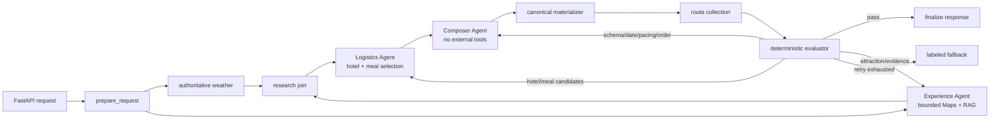

# Intelligent Trip Planner

A stateful AI trip-planning application that combines three bounded specialist agents, live travel services, destination-focused retrieval, canonical materialization, and evaluator-owned recovery.

The backend uses **FastAPI**, **LangChain**, and **LangGraph** to coordinate an Experience Agent, Logistics Agent, and tool-free Composer Agent. Google Maps supplies provider-backed places, Chroma supplies approved destination knowledge, and deterministic code owns weather, canonical provider fields, budgets, validation, retry routing, and fallback. The web client is a **React + Vite + TypeScript** application with Google Maps rendering.

## Why This Project

Generating an itinerary is not a single prompt problem. A useful plan must align dates, preserve the user's transportation and accommodation choices, use real POIs, incorporate destination-specific guidance, remain internally consistent, and recover when model output is malformed or unsupported.

This project treats trip planning as a typed, evidence-bounded multi-agent workflow instead of an opaque LLM call or an unrestricted agent swarm.

## Architecture



Core layers:

- **Bounded specialists:** independent model invocations, prompts, typed proposals, tool permissions, and revision budgets for Experience, Logistics, and Composer.
- **Typed communication:** agents exchange versioned source IDs through `ExperienceProposal`, `LogisticsProposal`, and `IDBasedItineraryDraft`, not an unrestricted shared transcript.
- **Canonical identity:** prompt-local `A/H/M` aliases resolve into request-local registry IDs; a deterministic materializer supplies names, addresses, coordinates, ratings, and links.
- **Deterministic recovery:** the evaluator assigns failures to the responsible agent, invalidates stale downstream proposals, and enforces per-role and global call budgets.
- **RAG:** Chroma with OpenAI `text-embedding-3-small` embeddings over approved destination knowledge.
- **Deterministic services:** authoritative weather data and direct Google Maps POI retrieval.
- **Evaluation and observability:** hard validation, independent canonical-field auditing, evidence attribution, per-agent latency/tool traces, and SQLite-backed run inspection.
- **Human-in-the-loop ingestion:** source manifest, rule-based extraction, draft review, approved promotion, and index rebuild.

## Verification And Failure Testing

The reliability layer separates deterministic validation from model generation:

- Pydantic rejects malformed or inconsistent requests before LangGraph, external services, or the LLM are invoked.
- Request validation covers blank required fields, strict ISO dates, reversed ranges, date/travel-day mismatches, oversized free text, noisy whitespace, duplicate preferences, and bounded prompt-injection-style input.
- Service resilience tests cover transient Google Maps provider timeouts, exhausted retry budgets, and provider error responses.
- Graph tests cover malformed planner JSON, targeted grounding retries, retry exhaustion, fallback behavior, authoritative weather, checkpoint state, and current-request alignment.

The backend suite currently contains **200+ deterministic unit and API-boundary tests**. CI runs these tests without real external API keys or paid model calls.

## Verified Internal Benchmark Signals

The fixed internal benchmark uses 12 U.S. trip requests with two repeats per case. These are engineering signals, not production traffic or statistical significance.

Controlled Single-vs-Multi A/B:

| Metric | Single baseline | Initial Multi |
| --- | ---: | ---: |
| Validated pass rate | 75% | 100% |
| First-pass validation | 37.5% | 91.7% |
| Fallback rate | 25% | 0% |
| Grounding pass rate | 79.2% | 100% |
| Unsupported entity rate | 4.4% | 0% |

Current Multi stability evidence:

| Metric | Live providers | Fixed-evidence replay |
| --- | ---: | ---: |
| Validated workflows | 24/24 | 24/24 |
| Overall source-ID Jaccard | 0.5688 | 0.7515 |
| Attraction Jaccard | 0.5694 | 0.6889 |
| Primary hotel exact match | 0.6667 | 1.0000 |
| Candidate pool / shortlist Jaccard | 0.8875 / 0.8015 | 1.0000 / 1.0000 |
| Independent canonical-field mismatches | 0 | 0 |
| Per-workflow budget violations | 0 | 0 |

Replay freezes normalized registry entities, RAG chunks, and authoritative weather while rerunning agent selection and composition. The live/replay gap localizes provider evidence variance instead of presenting every change as model instability. The live hotel target of 0.75 was not reached in this run; the fixed-evidence result shows that remaining live variance is primarily upstream of the selection policy.

The parallel harness defaults to two isolated workers. In a separate 24-workflow timing comparison, Worker 2 reduced local benchmark wall time by **50.09%** relative to Worker 1. This is a local benchmark improvement, not a production throughput claim.

A sanitized, fingerprinted summary is included at `backend/benchmarks/results/public-summary.json`; full live outputs and normalized evidence snapshots remain local and ignored.

## Observability Preview

The local dashboard exposes aggregate reliability metrics, failure categories, retry paths, node latency, quality diagnostics, and recommendation-level evidence links.


## Quick Start

Prerequisites:

- Python 3.11+
- Node.js 20+
- Google Maps Platform API key with Places, Geocoding, Routes, and Maps JavaScript APIs enabled
- OpenAI or OpenAI-compatible LLM API key

Start the backend:

```bash
cd backend
python -m venv venv
source venv/bin/activate
pip install -r requirements.txt
cp .env.example .env
uvicorn app.api.main:app --reload --host 0.0.0.0 --port 8000
```

Start the web client:

```bash
cd frontend
npm install
cp .env.example .env
npm run dev
```

Open `http://localhost:5173`. API documentation is available at `http://localhost:8000/docs`.

## Example Request

```bash
curl -X POST http://localhost:8000/api/trip/plan \
  -H "Content-Type: application/json" \
  -d '{
    "city": "New York",
    "start_date": "2026-07-01",
    "end_date": "2026-07-02",
    "travel_days": 2,
    "transportation": "Public transit",
    "accommodation": "Mid-range hotel",
    "preferences": ["Museums", "Food"],
    "free_text_input": "Keep the itinerary relaxed."
  }'
```

## Tests And Benchmarks

```bash
cd backend
venv/bin/python -m unittest discover -s tests -p "test_*.py"

venv/bin/python scripts/build_rag_index.py --rebuild
venv/bin/python scripts/benchmark_trip_planners.py \
  --dataset benchmarks/trip_requests.rag_benchmark.json \
  --output benchmarks/results/trip_planner_rag_benchmark.json

venv/bin/python scripts/benchmark_multi_agent_stability.py \
  --repeat-count 2 --max-workers 2 --evidence-mode record \
  --evidence-snapshot benchmarks/results/multi_agent_evidence_snapshot.json \
  --output benchmarks/results/multi_agent_live_record.json

venv/bin/python scripts/benchmark_multi_agent_stability.py \
  --repeat-count 2 --max-workers 2 --evidence-mode replay \
  --evidence-snapshot benchmarks/results/multi_agent_evidence_snapshot.json \
  --output benchmarks/results/multi_agent_replay.json
```

```bash
cd frontend
npm run build
```

## Repository Boundaries

The repository includes approved seed knowledge and benchmark datasets. Generated Chroma indexes, SQLite runtime state, raw fetched pages, review drafts, secrets, and local observability databases are intentionally excluded.

## Limitations

- The approved runtime corpus is a small 12-document English U.S. seed set, not complete U.S. coverage.
- The active stability benchmark has 12 cases and two repeats; it is not a statistical study.
- Live provider results still introduce hotel, meal, day-assignment, and route-order variance.
- Route-time evaluation is optional and disabled in the cited stability runs.
- Soft quality scores are diagnostic signals and do not trigger retries by default.
- Checkpointing and observability use local in-memory/SQLite infrastructure rather than production distributed storage.

## License

[MIT](LICENSE)
