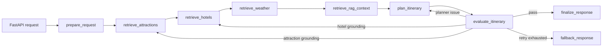
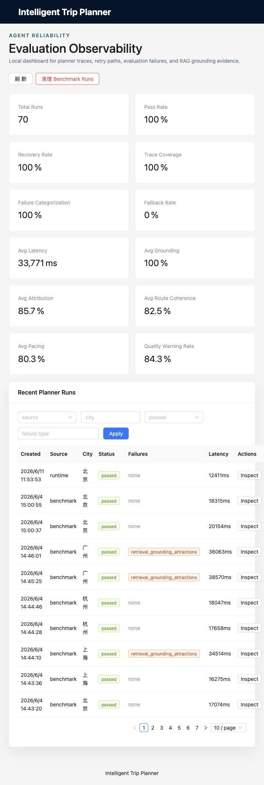

# Intelligent Trip Planner

A stateful AI trip-planning application that combines live travel services, destination-focused retrieval, structured generation, and an evaluation-driven recovery loop.

The backend uses **FastAPI**, **LangChain**, and **LangGraph** to coordinate Google Maps place retrieval, hotel retrieval, deterministic weather lookup, Chroma RAG, itinerary generation, validation, retry routing, fallback handling, memory, and local observability. The web client is a **React + Vite + TypeScript** application with Google Maps rendering.

## Why This Project

Generating an itinerary is not a single prompt problem. A useful plan must align dates, preserve the user's transportation and accommodation choices, use real POIs, incorporate destination-specific guidance, remain internally consistent, and recover when model output is malformed or unsupported.

This project treats trip planning as a typed workflow with explicit reliability controls instead of an opaque LLM call.

## Architecture



Core layers:

- **LangGraph orchestration:** typed state, in-memory checkpointing, conditional retries, fallback control flow.
- **LangChain runtime:** `ChatOpenAI`, structured output parsing, and native Google Maps tool wrappers.
- **RAG:** Chroma with OpenAI `text-embedding-3-small` embeddings over approved destination knowledge.
- **Deterministic services:** authoritative weather data and direct Google Maps POI retrieval.
- **Evaluation and observability:** hard validation, soft quality diagnostics, evidence attribution, node latency, retry traces, and SQLite-backed run inspection.
- **Human-in-the-loop ingestion:** source manifest, rule-based extraction, draft review, approved promotion, and index rebuild.

## Verification And Failure Testing

The reliability layer separates deterministic validation from model generation:

- Pydantic rejects malformed or inconsistent requests before LangGraph, external services, or the LLM are invoked.
- Request validation covers blank required fields, strict ISO dates, reversed ranges, date/travel-day mismatches, oversized free text, noisy whitespace, duplicate preferences, and bounded prompt-injection-style input.
- Service resilience tests cover transient Google Maps provider timeouts, exhausted retry budgets, and provider error responses.
- Graph tests cover malformed planner JSON, targeted grounding retries, retry exhaustion, fallback behavior, authoritative weather, checkpoint state, and current-request alignment.

The backend suite currently contains **52 deterministic unit and API-boundary tests**. CI runs these tests without real external API keys or paid model calls.

## Verified Internal Benchmark Signals

On a fixed internal 12-request benchmark for the RAG/evaluation layer:

| Metric | Result | Denominator / interpretation |
| --- | ---: | --- |
| Retrieval recall@4 | 91.67% | Average expected-document recall across 12 labeled requests |
| Retrieval hit rate | 100% | 12/12 requests retrieved at least one expected document |
| Hard validation pass rate | 100% | 12/12 final itineraries passed deterministic hard checks |
| Evidence attribution coverage | 100% | Generated attraction/hotel recommendations mapped to retrieved evidence |
| Recovery rate for initially failed runs | 100% | 3/3 initially failed generations passed after controlled retries |
| Fallback rate | 0% | 0/12 requests exhausted the retry budget |

These are internal benchmark results, not production traffic metrics. The dataset and a sanitized summary are included for reproducibility.

## Observability Preview

The local dashboard exposes aggregate reliability metrics, failure categories, retry paths, node latency, quality diagnostics, and recommendation-level evidence links.



## Quick Start

Prerequisites:

- Python 3.11+
- Node.js 20+
- Google Maps Platform API key with Places, Geocoding, Routes, and Maps JavaScript APIs enabled
- OpenAI or OpenAI-compatible LLM API key

Start the backend:

```bash
cd backend
python -m venv venv
source venv/bin/activate
pip install -r requirements.txt
cp .env.example .env
uvicorn app.api.main:app --reload --host 0.0.0.0 --port 8000
```

Start the web client:

```bash
cd frontend
npm install
cp .env.example .env
npm run dev
```

Open `http://localhost:5173`. API documentation is available at `http://localhost:8000/docs`.

## Example Request

```bash
curl -X POST http://localhost:8000/api/trip/plan \
  -H "Content-Type: application/json" \
  -d '{
    "city": "New York",
    "start_date": "2026-07-01",
    "end_date": "2026-07-02",
    "travel_days": 2,
    "transportation": "Public transit",
    "accommodation": "Mid-range hotel",
    "preferences": ["Museums", "Food"],
    "free_text_input": "Keep the itinerary relaxed."
  }'
```

## Tests And Benchmarks

```bash
cd backend
venv/bin/python -m unittest discover -s tests -p "test_*.py"

venv/bin/python scripts/build_rag_index.py --rebuild
venv/bin/python scripts/benchmark_trip_planners.py \
  --dataset benchmarks/trip_requests.rag_benchmark.json \
  --output benchmarks/results/trip_planner_rag_benchmark.json
```

```bash
cd frontend
npm run build
```

## Repository Boundaries

The repository includes approved seed knowledge and benchmark datasets. Generated Chroma indexes, SQLite runtime state, raw fetched pages, review drafts, secrets, and local observability databases are intentionally excluded.

## Limitations

- The active map provider is Google Maps, but the curated RAG corpus still contains earlier China-focused seed knowledge.
- US-city RAG coverage is not complete yet; unmatched cities use generic English planning guidance rather than unrelated city chunks.
- Route coherence uses coordinate-distance heuristics rather than live route-time evaluation.
- Soft quality scores are diagnostic signals and do not trigger retries by default.
- Internal benchmarks are intentionally small and should not be interpreted as production-scale evaluation.

## License

[MIT](LICENSE)
