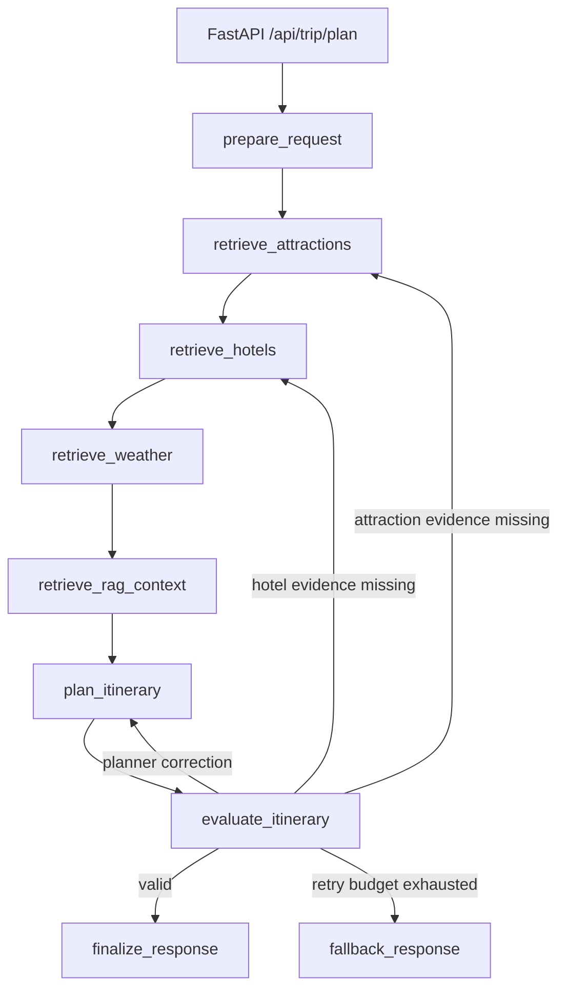

# Architecture

## Overview

Intelligent Trip Planner models itinerary generation as a stateful workflow rather than a single LLM call. FastAPI accepts a typed `TripRequest`, LangGraph coordinates retrieval and planning nodes, and a dedicated evaluator determines whether the result can be finalized, retried, or replaced with a safe fallback.

## Runtime Layers

### API layer

FastAPI routes expose trip planning, map/POI operations, memory inspection, and local observability. Public request and response contracts use Pydantic models.

### Orchestration layer

`LangGraphTripPlanner` owns graph construction and node execution. `TripGraphState` keeps structured request context, candidates, weather, RAG chunks, draft plans, evaluation reports, retry counts, traces, and metrics.

`MemorySaver` checkpoints graph state by `thread_id`. It currently supports local inspection and checkpointed execution state; a durable shared checkpoint store is a future improvement.

### Generation and tool layer

LangChain `ChatOpenAI` generates structured itineraries. The planner uses `PydanticOutputParser(TripPlan)` first and a strict JSON fallback parser second.

AMap is wrapped as a native LangChain `StructuredTool`. Retrieval nodes call the tool directly and write normalized candidates into graph state. This keeps tool execution separate from planner generation.

### Deterministic services

Weather is retrieved outside the LLM and is authoritative. Planner-produced weather is overwritten with date-aligned service output before evaluation.

The evaluator also deterministically normalizes budget totals, checks current-request alignment, scores grounding, and builds evidence links.

## Typed State Contract

Important state groups:

- Request: normalized `TripRequest`, travel dates, request context, conversation ID.
- Retrieval: attraction candidates, hotel candidates, authoritative weather, RAG chunks.
- Generation: planner input bundle, raw model output, parsed draft plan.
- Reliability: evaluation report, evaluation history, node retry counts, decision trace, run metrics.
- Output: validated final plan or fallback plan.

Structured state makes retries targeted. For example, low attraction grounding reruns attraction retrieval instead of repeating weather and hotel calls.

## Failure Handling

Hard validation failures drive control flow:

- Malformed schema, missing dates, or inconsistent request alignment reruns the planner.
- Unsupported attractions rerun attraction retrieval.
- Unsupported hotels rerun hotel retrieval.
- Exhausted retry budgets return a safe, date-aligned fallback.

Soft diagnostics such as pacing, route coherence, and preference match are recorded for observability but do not trigger retries by default. This avoids allowing heuristic quality scores to destabilize the workflow.

## Memory And Observability

The project separates:

- LangGraph execution checkpoints.
- SQLite-backed anonymous profile and conversation memory.
- SQLite-backed run summaries and node-level observability events.

Observability persistence is best-effort. A storage failure must not fail a successful trip-planning response.

## Migration Note

The project began as a sequential agent prototype. The current public runtime is fully LangChain-native and LangGraph-centered. Legacy framework code and dependencies were removed so the production and test paths use the same runtime boundaries.
